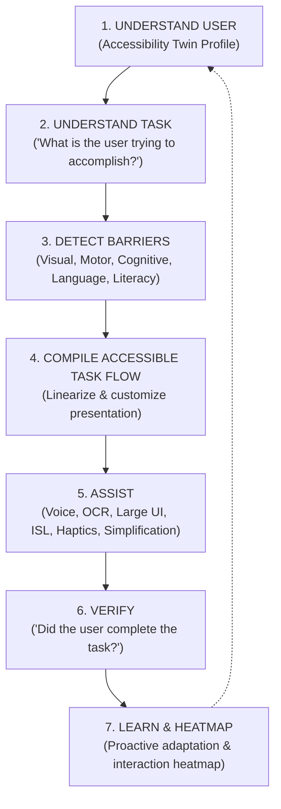

# Sahayak AI (सहायक AI)
### Intent-Aware Personal Accessibility Copilot

[](https://opensource.org/licenses/MIT)
[](https://fastapi.tiangolo.com)
[](https://flutter.dev)
[](https://www.w3.org/WAI/standards-guidelines/wcag/)

> **"Traditional accessibility software gives users a box of AI tools and expects them to know which one to pick.**  
> **Sahayak AI understands what the person is trying to accomplish, identifies their interaction barriers, and adapts technology to them."**

---

## 🌟 The Core Innovation: The Accessibility Twin

The **Accessibility Twin** is a dynamic, software-defined profile describing how a user prefers and needs to interact with digital information and physical tasks.

### Ethical Guarantee:
* The Accessibility Twin is **NOT a medical profile** and **MUST NOT diagnose a disability**.
* It models **functional interaction preferences** rather than clinical pathology (e.g., *"prefers voice over typing"*, *"benefits from high contrast yellow-on-black"*, *"requires one-step-at-a-time task linearization"*).

---

## 🔄 The 7-Stage Intent-Aware Task Pipeline

Every user request flows through Sahayak's unified 7-stage architectural pipeline:



---

## 🎯 The Three Primary Hackathon Demonstrations

### 1. DEMO 1 — Understand a Complex Document (Notice Comprehension)
* **User Query**: *"What is important in this notice?"*
* **Pipeline**:
  1. OCR extracts dense text & layout.
  2. Document Understanding locates authority, key deadlines (**September 30, 2026**), and prerequisite documents (**Income Certificate, Aadhaar Card**).
  3. Barrier Engine identifies legal jargon and English language mismatch.
  4. Flow Compiler synthesizes plain-language Hindi spoken and visual bullet points.
  5. Copilot proactively asks: *"Would you like me to guide you through the application form?"*

### 2. DEMO 2 — Complete a Multi-Field Form (Flagship Demonstration)
* **User Query**: *"Help me fill this scholarship form."*
* **Pipeline**:
  1. Form Analyzer detects 7 required fields with fine print and small paper boxes.
  2. Barrier Engine flags visual, motor, and cognitive complexity barriers.
  3. Flow Compiler flattens the multi-field form into a single question at a time.
  4. Conversational Voice Copilot prompts each question in Hindi/English:
     * *Step 1: Full Name ("सात्विक शर्मा")* -> Confirmed via tactile haptic buzz.
     * *Step 2: Date of Birth ("15/08/2003")* -> Formatted & validated.
     * *Steps 3–7: Address, Category, Income, Aadhaar, Bank & IFSC.*
  5. Task Verification Service verifies all 7 fields, checks constraints, and issues an official verification certificate (`VERIFIED_SAHAYAK_...`).

### 3. DEMO 3 — Sign Language Communication (ISL Interpreter)
* **User Action**: Team member signs an Indian Sign Language gesture (e.g. **"HELP"** or alphabet letters).
* **Pipeline**:
  1. MediaPipe 3D hand tracking extracts 21 coordinates per hand in real-time.
  2. ISL Classifier identifies dynamic gesture trajectory.
  3. Assist Engine speaks out *"Help"*, displays prominent high-contrast captions, and vibrates with double confirmation pulses.

### 🌟 OPTIONAL WOW DEMO — Directional Object Finding
* **User Query**: *"Find my bottle."*
* **Pipeline**: YOLO/Heuristic camera scanning detects bottle bounding box and calculates spatial offset: *"आपकी बोतल आपके दाईं ओर हाथ की पहुंच में है।" (Your bottle is slightly to your right, within arm's reach)* with directional right-side haptic cues.

---

## 📊 The Accessibility Heatmap & Personalization

Sahayak tracks local session friction points to generate an **Interaction Complexity Heatmap**:
* 🔴 **RED**: High interaction complexity (e.g. multi-step camera document alignment).
* 🟡 **YELLOW**: Moderate interaction complexity (e.g. long address input).
* 🟢 **GREEN**: Low interaction complexity (e.g. single-word voice confirmation).

Based on repeated friction signals, Sahayak proposes consented proactive personalization:
> *"Would you like Sahayak to use simplified Hindi and voice guidance automatically for all future applications?"*

---

## 🏗️ Monorepo Architecture

```
sahayak-ai/
│
├── mobile/                  # Flutter Android Mobile App (Material 3)
│   ├── lib/
│   │   ├── models/          # AccessibilityTwin, TaskFlow, Verification models
│   │   ├── screens/         # Home, CompleteForm, ReadDocument, SignTalk, See, Insights, Profile
│   │   ├── services/        # ApiService, HapticsService
│   │   └── theme/           # Standard and WCAG AAA High-Contrast themes
│   └── pubspec.yaml
│
├── backend/                 # FastAPI Asynchronous Orchestrator
│   ├── main.py              # Normalized REST routes (/api/v1/...)
│   ├── config.py            # Environment configuration
│   └── venv/                # Dedicated Python virtual environment
│
├── ai/                      # Domain AI Engines & Adapters
│   ├── accessibility/       # AccessibilityTwin service
│   ├── intent/              # Intent classification engine
│   ├── barrier/             # Barrier detection rule engine
│   ├── task/                # Task state engine
│   ├── compiler/            # Accessible task flow compiler
│   ├── assistance/          # Multi-capability assistance orchestrator
│   ├── verification/        # Completion verification service
│   ├── learning/            # Telemetry & Accessibility Heatmap
│   ├── vision/              # Directional finder & spatial guidance
│   ├── ocr/                 # Document understanding & text extraction
│   ├── scene/               # SceneFusion (associating text with objects)
│   └── isl/                 # Indian Sign Language MediaPipe classifier
│
├── shared/
│   └── schemas/             # Normalized Pydantic models
│
├── docs/                    # Architecture, Audit & Demo specifications
│   ├── ARCHITECTURE.md
│   ├── REPOSITORY_AUDIT.md
│   ├── API.md
│   ├── ACCESSIBILITY_TWIN.md
│   ├── TASK_PIPELINE.md
│   ├── DEMO_FLOW.md
│   └── TEAM_WORKFLOW.md
│
├── scripts/                 # run_backend.sh, run_mobile.sh
├── .env.example
├── .gitignore
├── THIRD_PARTY_LICENSES.md
└── LICENSE
```

---

## 🚀 Quickstart & Execution Guide

### 1. Launch FastAPI Backend
```bash
# Navigate to project root
cd /home/user/Desktop/PROJECTS/AccessIt

# Start backend using the virtual environment
source backend/venv/bin/activate
uvicorn backend.main:app --host 0.0.0.0 --port 8000 --reload
```
Test health check:
```bash
curl http://127.0.0.1:8000/api/v1/health
```

### 2. Launch Flutter Application
```bash
cd mobile

# Ensure Flutter is in your PATH
export PATH=/home/user/development/flutter/bin:$PATH

# Run tests
flutter test

# Run application on connected device or Chrome
flutter run -d chrome
# or for Android device:
# flutter run
```

---

## 📜 Licenses & Attribution

Sahayak AI is licensed under the **MIT License**. Third-party components adapted from audited repositories (`VisualAid`, `ISL-Interpreter`, `SightBuddy`, `SightAssist`) are credited under their respective MIT/Apache-2.0 licenses in [`THIRD_PARTY_LICENSES.md`](file:///home/user/Desktop/PROJECTS/AccessIt/THIRD_PARTY_LICENSES.md).