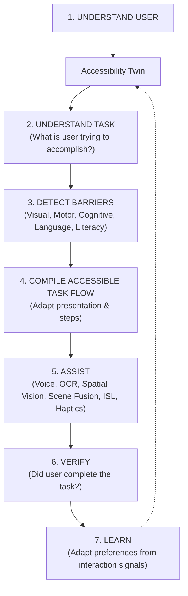

# Sahayak AI — System Architecture Specification

**System**: Sahayak AI (सहायक AI)  
**Product Concept**: Intent-Aware Personal Accessibility Copilot  
**Author**: Lead Software Architect  
**Version**: 2.0.0 (Extended Hackathon MVP Architecture)

---

## 1. Core Architectural Principle

Traditional accessibility solutions force users to become "AI engineers" choosing between disjointed tools:
`[OCR Button]`, `[TTS Toggle]`, `[Object Detection]`, `[Sign Language]`, `[Large Text]`.

**Sahayak AI transforms this completely.** The user expresses an intent or task (*"Help me fill this application"*, *"What is important in this notice?"*, *"Find my medicine"*), and Sahayak dynamically analyzes interaction barriers and compiles an accessible, step-by-step guidance flow tailored to that user's **Accessibility Twin**.



---

## 2. The 7-Stage Pipeline & Extended Capabilities

| Stage / Capability | Engine / Service | Status | Responsibility |
|---|---|---|---|
| **1. Understand User** | `AccessibilityTwin` & `twin_service` | `IMPLEMENTED` | Functional preferences (speech vs text, Hindi/English, contrast, step-by-step). |
| **2. Understand Task** | `IntentEngine` & `TaskEngine` | `IMPLEMENTED` | Multilingual intent classification (`FORM_COMPLETION`, `UNDERSTAND_DOCUMENT`, `COMMUNICATE`, `FIND_OBJECT`, `SEE`, `READ`). |
| **3. Detect Barriers** | `BarrierEngine` | `IMPLEMENTED` | Detects visual, motor, cognitive, language, digital literacy, and complexity impediments. |
| **4. Compile Flow** | `AccessibleTaskFlowCompiler` | `IMPLEMENTED` | Compiles linearized, adaptive multi-turn sequential flows. |
| **5. Assist & Modalities** | `AccessibilityAssistanceEngine` & `response_service` | `IMPLEMENTED` | Voice audio prompts, OCR, ISL interpretation, 12-hour clock spatial vision, scene understanding, tactile haptic cues. |
| **6. Verify** | `TaskVerificationService` | `IMPLEMENTED` | Validates field constraints and issues verification tokens upon 100% completion. |
| **7. Learn** | `AccessibilityLearningService` | `IMPLEMENTED` | Aggregates telemetry to generate friction heatmaps and proactive adaptation proposals. |
| **Spatial Vision** | `DirectionalFinder` & `see_router` | `IMPLEMENTED` | 12-hour clock guidance, vertical elevation, and proximity estimation. |
| **Scene Fusion** | `SceneFusion` & `scene_router` | `IMPLEMENTED` | Fuses physical object bounding boxes with nearby OCR text signage. |
| **Voice Assistant** | `pipeline_service` & `voice_router` | `IMPLEMENTED` | Speech-to-Intent parsing, conversational responses, and TTS contracts. |
| **Smart Navigation** | `pipeline_service` & `navigation_router` | `IMPLEMENTED` | Stateful navigation guidance and obstacle avoidance. |
| **Document Q&A** | `pipeline_service` & `session_service` | `IMPLEMENTED` | Grounded multi-turn question answering over scanned documents. |
| **Document-to-Task** | `pipeline_service` & `read_router` | `IMPLEMENTED` | Automatically converts extracted notice requirements into actionable tasks. |
| **Error Recovery** | `pipeline_service` & Exception Middleware | `IMPLEMENTED` | Deterministic fallback handling with machine-readable `RecoveryResult`. |

---

## 3. High-Level Monorepo Structure

```
sahayak-ai/
│
├── backend/                 # FastAPI Asynchronous Orchestrator
│   ├── main.py              # Application entry point, global recovery & router aggregation
│   ├── config.py            # Environment configuration & settings
│   ├── routes/              # Modular Domain Routers
│   │   ├── complete.py      # /complete/analyze, /complete/respond
│   │   ├── read.py          # /read, /read/qa, /read/tasks
│   │   ├── isl.py           # /isl/predict
│   │   ├── see.py           # /see, /see/spatial
│   │   ├── voice.py         # /voice/command, /voice/tts
│   │   ├── scene.py         # /scene/analyze, /scene/fusion
│   │   ├── assistance.py    # /assistance/multimodal
│   │   ├── navigation.py    # /navigation/guide, /navigation/session
│   │   ├── verification.py  # /task/verify, /verification/check
│   │   └── learning.py      # /learning/heatmap, /learning/personalization
│   └── services/            # Backend Orchestration Services
│       ├── pipeline_service.py # End-to-end 7-stage coordinator
│       ├── session_service.py  # Stateful multi-turn session cache
│       └── response_service.py # Normalized multimodal response builder
│
├── shared/                  # Common resources & schemas
│   ├── schemas/
│   │   ├── models.py        # Core models + aggregated re-exports
│   │   ├── vision_models.py # VisionObject, SceneAnalysis, ObjectTextRelation
│   │   ├── form_models.py   # FormFieldAnalysis, FormRespond models
│   │   ├── document_models.py # DocumentSummary, Q&A, DocumentTask
│   │   ├── isl_models.py    # ISLPredictionRequest/Response, HandLandmark
│   │   └── task_models.py   # Voice, Navigation, Assistance, Recovery, Personalization
│   └── demo_data/           # Real forms and notice assets for evaluation
│
├── ai/                      # Domain AI Engines & Interfaces (Strictly Isolated)
│   ├── accessibility/       # AccessibilityTwin data model & manager
│   ├── intent/              # IntentEngine
│   ├── task/                # TaskEngine
│   ├── barrier/             # BarrierEngine
│   ├── compiler/            # AccessibleTaskFlowCompiler
│   ├── assistance/          # AccessibilityAssistanceEngine
│   ├── verification/        # TaskVerificationService
│   ├── learning/            # AccessibilityLearningService
│   ├── vision/              # DirectionalFinder
│   ├── ocr/                 # DocumentOCREngine (RapidOCR)
│   ├── scene/               # SceneFusion
│   └── isl/                 # ISLInterpreterService (MediaPipe)
│
├── mobile/                  # Android Flutter Application
├── frontend/                # React / TypeScript Web Interface
├── sahayak_ai.html          # Standalone Zero-Setup Portable Demo App
├── tests/                   # Comprehensive Unit & Integration Test Suite
│   ├── unit/                # 9 domain unit test suites
│   └── integration/         # 5 end-to-end integration test suites
├── scripts/                 # Execution & demo verification scripts
└── docs/                    # Complete Architecture & Feature Documentation
```
