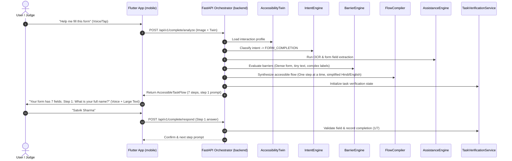

# Sahayak AI — System Architecture Specification

**System**: Sahayak AI (सहायक AI)  
**Product Concept**: Intent-Aware Personal Accessibility Copilot  
**Author**: Lead Software Architect  
**Version**: 1.0.0 (Hackathon MVP Architecture)

---

## 1. Core Architectural Principle

Traditional accessibility solutions force users to become "AI engineers" choosing between tools:
`[OCR Button]`, `[TTS Toggle]`, `[Object Detection]`, `[Sign Language]`, `[Large Text]`.

**Sahayak AI transforms this completely.** The user expresses an intent or task (*"Help me fill this application"*, *"What is important in this notice?"*, *"Find my medicine"*), and Sahayak dynamically analyzes the interaction barriers and compiles an accessible, step-by-step guidance flow tailored to that user's **Accessibility Twin**.


---

## 2. The 7-Stage Pipeline

| Stage | Engine / Service | Primary Responsibility |
|---|---|---|
| **1. Understand User** | `AccessibilityTwin` | Models interaction preferences (speech vs text, Hindi/English, contrast, step-by-step) **without medical diagnosing**. |
| **2. Understand Task** | `IntentEngine` & `TaskEngine` | Classifies user goal (`FORM_COMPLETION`, `UNDERSTAND_DOCUMENT`, `COMMUNICATE`, `FIND_OBJECT`, `SEE`, `READ`). |
| **3. Detect Barriers** | `BarrierEngine` | Identifies visual, hearing, motor, cognitive, language, digital literacy, and complexity impediments. |
| **4. Compile Flow** | `AccessibleTaskFlowCompiler` | Transforms the task into an accessible, linearized, interactive sequence suited to the user's Twin. |
| **5. Assist** | `AccessibilityAssistanceEngine` | Selects and coordinates AI capabilities (OCR, Vision, ISL, TTS, STT, Haptics, Simplified UI). |
| **6. Verify** | `TaskVerificationService` | Validates real task completion (`COMPLETED`, `IN_PROGRESS`, `BLOCKED`, `NEEDS_CONFIRMATION`, `FAILED`). |
| **7. Learn** | `AccessibilityLearningService` | Records consented telemetry to recommend proactive accessibility adjustments. |

---

## 3. High-Level Monorepo Architecture

```
sahayak-ai/
│
├── mobile/                  # Android Flutter Application (Material 3 + Riverpod)
│   ├── lib/
│   │   ├── app/             # App routing, themes (High Contrast, Standard)
│   │   ├── core/            # Services: API client, Audio cues, Haptics, Local storage
│   │   ├── features/        # Feature screens: Onboarding, Home, See, Read, Talk, Complete, Insights
│   │   ├── models/          # Dart models matching backend Pydantic schemas
│   │   └── widgets/         # Accessible tactile buttons, dynamic text scale widgets
│   └── pubspec.yaml
│
├── backend/                 # FastAPI Asynchronous Orchestrator
│   ├── main.py              # Application entry point & router aggregation
│   ├── config.py            # Environment configuration & model paths
│   └── routers/             # Normalized REST API routes (/api/v1/...)
│
├── ai/                      # Domain AI Engines & Interfaces
│   ├── accessibility/       # AccessibilityTwin data model & manager
│   ├── intent/              # IntentEngine (Task classifier & goal extraction)
│   ├── task/                # TaskEngine (Task state machine & steps)
│   ├── barrier/             # BarrierEngine (Rule-based & layout barrier detector)
│   ├── compiler/            # AccessibleTaskFlowCompiler (Flow synthesizer)
│   ├── assistance/          # AccessibilityAssistanceEngine (Orchestrator)
│   ├── verification/        # TaskVerificationService (Completion validator)
│   ├── learning/            # AccessibilityLearningService (Interaction telemetry & heatmap)
│   ├── vision/              # Object detection, directional guidance
│   ├── ocr/                 # OCR text extraction & document layout
│   ├── scene/               # SceneFusion (spatial object-text association)
│   ├── isl/                 # Indian Sign Language MediaPipe landmark engine
│   └── speech/              # Multilingual TTS & STT normalization
│
├── shared/                  # Common resources
│   ├── schemas/             # Pydantic schemas shared across services
│   ├── demo_data/           # Deterministic forms, notices, and test images for judging
│   └── accessibility/       # Standard accessibility tokens & color schemes
│
├── docs/                    # Architectural & operational documentation
│   ├── ARCHITECTURE.md
│   ├── REPOSITORY_AUDIT.md
│   ├── API.md
│   ├── ACCESSIBILITY_TWIN.md
│   ├── TASK_PIPELINE.md
│   ├── DEMO_FLOW.md
│   └── TEAM_WORKFLOW.md
│
├── third_party/             # Attributions and upstream reference notices
│   └── attribution/
│
├── scripts/                 # Development run scripts & test runners
├── .env.example
├── .gitignore
├── README.md
├── THIRD_PARTY_LICENSES.md
└── LICENSE
```

---

## 4. Subsystem Interactions



---

## 5. Non-Functional & Ethical Guarantees

1. **No Medical Labels**: Sahayak AI never labels a human being as "blind", "deaf", or "disabled". Profiles represent **functional interaction preferences** (e.g., `prefers_voice: true`, `needs_large_text: true`).
2. **Local Demo Telemetry**: Telemetry is strictly stored locally on device. No sensitive personal data or biometric voiceprints are transmitted to external servers without explicit consent.
3. **Resilience & Graceful Degradation**: If heavy neural network weights are absent on edge deployment, engines automatically switch to deterministic heuristic fallback modes to guarantee uninterrupted live demonstrations.
