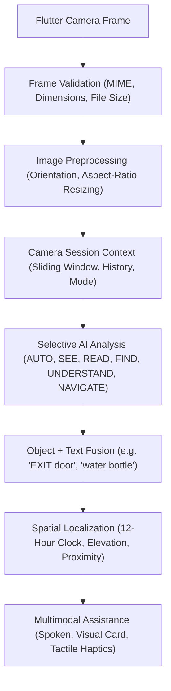

# Sahayak AI — Camera Intelligence Architecture & Integration Specification

**Feature**: Camera Intelligence Pipeline  
**Architecture**: FastAPI Model-Agnostic Frame Orchestrator + AI Subsystem (`ai/camera/`) + Session Context  
**Status**: `IMPLEMENTED` (Backend Route, Frame Validation, Session Management, Selective Mode Pipeline, Object+OCR Fusion, Multimodal Assistance, Error Recovery) / `AI SUBSYSTEM INTEGRATED` (`ai/camera/` engine, preprocessor, analyzer, session) / `MOBILE CONTRACT READY` (`mobile/lib/` Dart contracts)

---

## 1. Overview & Product Purpose

The **Camera Intelligence** subsystem serves as the high-throughput, adaptive visual perception gateway for Sahayak AI. It interfaces directly with camera hardware streams (mobile front/back cameras, webcams, wearable visual devices) and selectively routes high-quality frames to downstream perception models without overloading client batteries or server inference pipelines.



---

## 2. Directory Structure

```text
backend/
├── routes/
│   └── camera.py             # FastAPI endpoints (/api/v1/camera/analyze, /session, /session/reset)
└── services/
    └── camera_service.py     # Central orchestration, validation, mode routing, fusion

ai/camera/
├── __init__.py               # Package exports
├── camera_engine.py          # Central multimodal camera intelligence coordinator
├── frame_processor.py        # Blur, brightness, alignment, and duplicate frame detection
├── image_preprocessor.py     # Resizing, color transforms, rotation, perspective warping
├── camera_analyzer.py        # Task/mode capability planner to minimize model execution
└── camera_session.py         # Ephemeral session tracking and duplicate frame suppression

shared/schemas/
└── camera_models.py          # Unified Pydantic schemas
```

---

## 3. Supported Camera Analysis Modes

| Mode | Trigger / User Goal | Active AI Capabilities | Output Emphasis |
| :--- | :--- | :--- | :--- |
| **`AUTO`** | Default mode | Context/intent-aware resolver | Automatically routes to the optimal minimal pipeline based on user prompt or active task. |
| **`SEE`** | *"What is around me?"* | Spatial Vision + Object Detection | Discovers physical objects in view with 12-hour clock directions and elevations. |
| **`READ`** | *"Read this notice / document"* | RapidOCR ONNX Engine | Extracts structured lines of text, deadlines, fee, and requirement entities. |
| **`FIND`** | *"Where is my water bottle?"* | Target Matcher + Directional Finder | Locates target item, computes clock hour ($1 \dots 12$), proximity, and haptic cue. |
| **`UNDERSTAND`** | *"What is this in front of me?"* | Scene Fusion (Objects + OCR) | Fuses physical objects with adjacent text signage (e.g., `EMERGENCY EXIT (door)`). |
| **`NAVIGATE`** | *"Guide me to the exit / is path clear?"* | Obstacle Detector + Path Clearance | Identifies obstacles (pillars, stairs, doors), clock heading, and tactile pulses. |

---

## 4. REST API Specifications

### `POST /api/v1/camera/analyze`
Analyzes a camera frame and returns structured entity detections, scene interpretation, and multimodal assistance prompts.

* **Content-Type**: `multipart/form-data`
* **Parameters**:
  * `image` (Binary file): JPEG/PNG/WebP camera frame (Max 15MB).
  * `session_id` (Optional string): Active camera session ID for stateful continuity.
  * `twin_id` (String, default `"default_user"`): User's Accessibility Twin ID.
  * `mode` (String, default `"AUTO"`): One of `AUTO`, `SEE`, `READ`, `FIND`, `UNDERSTAND`, `NAVIGATE`.
  * `intent` / `query` (Optional string): User's natural language voice query or command.
  * `target_object` (Optional string): Specific item to locate (e.g., `"bottle"`, `"door"`).
  * `language` (Optional string): `"English"`, `"Hindi"`, etc.
  * `skip_duplicate_check` (Boolean, default `false`): Bypass perceptual duplicate frame suppression.

* **Response (200 OK)**:
```json
{
  "success": true,
  "session_id": "cam_ee7bca0d",
  "mode": "UNDERSTAND",
  "analysis": {
    "session_id": "cam_ee7bca0d",
    "mode": "UNDERSTAND",
    "intent": "What is in front of me?",
    "target_object": null,
    "objects": [
      {
        "object_id": "obj_primary_1",
        "label": "door",
        "confidence": 0.92,
        "bbox": [100, 50, 280, 420],
        "clock_direction": "at 10 o'clock",
        "clock_hour": 10,
        "relative_direction": "to your left",
        "proximity": "near",
        "elevation": "level",
        "associated_text": "EMERGENCY EXIT",
        "haptic_cue": "PULSE_LEFT",
        "haptic_intensity": "MEDIUM"
      }
    ],
    "text_elements": [
      {
        "text_id": "txt_1",
        "text": "EMERGENCY EXIT",
        "confidence": 0.96,
        "bbox": [120, 80, 260, 130]
      }
    ],
    "fused_relations": [
      {
        "object_id": "obj_fused_1",
        "object_label": "door",
        "associated_text": "EMERGENCY EXIT",
        "relationship": "contained_within",
        "combined_interpretation": "EMERGENCY EXIT (door)",
        "confidence": 0.94
      }
    ],
    "scene": {
      "scene_type": "indoor",
      "description": "Corridor area with an Emergency Exit door on the left.",
      "hazards": [],
      "navigable_path_clear": true,
      "suggested_action": "Proceed",
      "summary_spoken": "There is an EMERGENCY EXIT door on your left at 10 o'clock.",
      "summary_display": "Corridor area with an Emergency Exit door on the left.",
      "language": "English"
    },
    "target_found": true,
    "target_guidance": null,
    "hazards": [],
    "processing_metadata": {
      "latency_ms": 382.3,
      "frame_width": 320,
      "frame_height": 240
    },
    "confidence": 0.92,
    "status": "COMPLETED"
  },
  "assistance": {
    "spoken_response": "There is an EMERGENCY EXIT door on your left at 10 o'clock.",
    "display_response": "Corridor area with an Emergency Exit door on the left.",
    "haptic_cue": "PULSE_LEFT",
    "haptic_intensity": "MEDIUM",
    "priority": "NORMAL",
    "language": "English",
    "next_action": "CONTINUE_SCAN",
    "session_id": "cam_ee7bca0d",
    "visual_card": {
      "mode": "UNDERSTAND",
      "title": "Camera Assist: UNDERSTAND",
      "objects_count": 1,
      "text_count": 1,
      "fused_count": 1,
      "primary_label": "door",
      "high_contrast": false
    }
  },
  "next_action": "CONTINUE_SCAN",
  "processing": {
    "latency_ms": 382.3,
    "timestamp": "2026-09-28T08:53:10.123456"
  },
  "error": null
}
```

### `POST /api/v1/camera/session`
Creates a new stateful camera session.

### `GET /api/v1/camera/session?session_id=cam_ee7bca0d`
Fetches current session state, frame history, and latest detected entities.

### `POST /api/v1/camera/session/reset`
Clears session history, duplicate hashes, and cached results.

---

## 5. Mobile Integration Contract (`mobile/lib/`)

The mobile teammate can connect the Flutter camera stream using the following contracts:

### Recommended Files to Implement on Mobile:
* `mobile/lib/models/camera_result.dart`: Mirrors `CameraAnalysisResponse` JSON structure.
* `mobile/lib/services/camera_service.dart`: Sends periodic camera frames to `POST /api/v1/camera/analyze`.
* `mobile/lib/screens/camera_assistant/camera_screen.dart`: Renders camera preview with directional overlay arrows and triggers device vibration from `assistance.haptic_cue`.

### HTTP Request Details:
* **Endpoint**: `POST /api/v1/camera/analyze`
* **Timeout Recommendation**: 4.0 seconds per frame.
* **Stream Throttling**: Send frames at 1.0–2.0 Hz (1 frame every 500–1000ms) to conserve bandwidth and CPU.
* **Haptic Action**: Map `haptic_cue` string (`PULSE_LEFT`, `PULSE_RIGHT`, `DOUBLE_PULSE_CENTER`, `HIGH_URGENT`) to Flutter `HapticFeedback.vibrate()` or `vibration` plugin.

---

## 6. AI Subsystem Capabilities (`ai/camera/`)

The AI subsystem provides optimized pre-flight checks and multimodal perception:
* **`ImagePreprocessor`**: Rotation normalization, aspect-preserving downscaling (1280px max), 4-point perspective warp.
* **`FrameProcessor`**: Laplacian variance blur filtering, mean luminance check, perceptual dHash duplicate suppression.
* **`CameraSession`**: Ephemeral in-memory sliding window history without disk storage.
* **`CameraAnalyzer`**: Selective model activation planner (OCR vs Spatial Vision vs Navigation vs ISL).
* **`CameraEngine`**: Unified multimodal result coordinator.

---

## 7. Error Recovery & Safety Handling

1. **Invalid Frame / Corrupted Upload**:
   * Returns `HTTP 200` with `success=false` and machine-readable `error.error_code="INVALID_CAMERA_FRAME"`.
   * Assistance prompt gently reminds user: *"Camera frame invalid. Please hold steady and try again."*
2. **AI Inference Exception**:
   * Triggers non-blocking fallback mode.
   * `assistance.spoken_response` provides safe guidance without crashing.
3. **Privacy & Security**:
   * No raw camera frames are permanently stored to disk.
   * Session state only retains lightweight bounding box coordinates, labels, and text strings.
