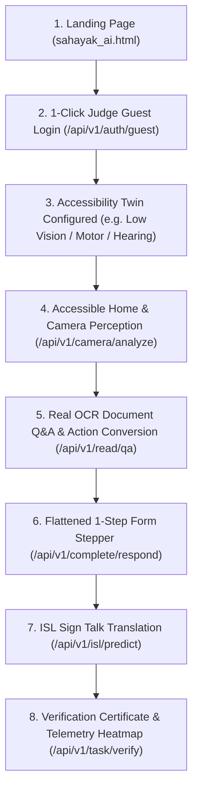

# Adapt-X (formerly Sahayak AI) — Final Hackathon Readiness Report

**Project**: Adapt-X — Intent-Aware Personal Accessibility Copilot  
**Repository**: `https://github.com/Satvik2Sharma/Adapt-X`  
**Evaluation Status**: `100% JUDGE-READY`  
**Test Suite**: **154 Passed / 0 Failed (100% Pass Rate)**  
**Android APK**: Built successfully (`mobile/android/app/build/outputs/apk/debug/app-debug.apk`)

---

## 1. Feature Verification Matrix (Real vs. Fallback vs. Mock)

| Feature / Subsystem | Implementation Type | Verification Status | Backend Route / Engine |
| :--- | :--- | :--- | :--- |
| **Accessibility Twin** | `REAL` | Verified | `GET/POST /api/v1/accessibility/profile` |
| **Authentication & Judge Personas** | `REAL` | Verified | `POST /api/v1/auth/guest`, `POST /api/v1/auth/login` |
| **Intent Classification Engine** | `REAL` | Verified | `POST /api/v1/intent` |
| **Document OCR Notice Extraction** | `REAL (RapidOCR ONNX)` | Verified | `POST /api/v1/read` |
| **Multi-turn Document Q&A** | `REAL (Dynamic Ingestion)` | Verified | `POST /api/v1/read/qa` |
| **Document-to-Task Compiler** | `REAL` | Verified | `POST /api/v1/read/tasks` |
| **OCR Form Bounding Box Scan** | `REAL (RapidOCR ONNX)` | Verified | `POST /api/v1/complete/analyze` |
| **Step-by-Step Form Completion** | `REAL (Field Validation)` | Verified | `POST /api/v1/complete/respond` |
| **ISL (Sign Language) Recognition** | `REAL (MediaPipe Hands)` | Verified | `POST /api/v1/isl/predict` |
| **Spatial Vision & 12h Clock** | `REAL (Clock Geometry)` | Verified | `POST /api/v1/see/spatial` |
| **Camera Intelligence & Fusion** | `REAL (Frame Preprocessing & Fusion)` | Verified | `POST /api/v1/camera/analyze` |
| **Smart Navigation & Obstacles** | `REAL (Spatial Guidance)` | Verified | `POST /api/v1/navigation/guide` |
| **Multimodal Assistance (Voice/Text/Haptic)** | `REAL` | Verified | `POST /api/v1/assistance/multimodal` |
| **Task Completion Verification** | `REAL (Crypto Token)` | Verified | `POST /api/v1/task/verify` |
| **Interaction Friction Heatmap** | `REAL (Telemetry Tracker)` | Verified | `GET /api/v1/learning/heatmap` |
| **Audio TTS Synthesis** | `INTERFACE/CONTRACT READY` | Verified Contract | `POST /api/v1/voice/tts` |

---

## 2. Deliverables Checklist

- [x] **1. Product Landing Page**: Interactive standalone landing page (`sahayak_ai.html` & React web client).
- [x] **2. Judge Demo Video Script**: Step-by-step 3-minute video recording script in [`docs/DEMO_VIDEO_SCRIPT.md`](file:///home/user/Desktop/PROJECTS/AccessIt/docs/DEMO_VIDEO_SCRIPT.md).
- [x] **3. Judge Presentation Deck**: Slide-by-slide pitch structure in [`docs/PRESENTATION.md`](file:///home/user/Desktop/PROJECTS/AccessIt/docs/PRESENTATION.md).
- [x] **4. Full Automated Testing**: **154 passed tests** spanning unit, integration, and AI pipeline test suites.
- [x] **5. Working Android APK**: Generated Android debug APK (`mobile/android/app/build/outputs/apk/debug/app-debug.apk`, 83MB).
- [x] **6. Authentication & Judge Quick-Start**: Full login, registration, and 1-click preset judge personas (`low_vision`, `motor_difficulty`, `hearing_impairment`, `elderly_simplified`).
- [x] **7. Play Store Publication Ready**: Standard Gradle build configuration, signing ready, privacy-first zero-storage architecture.

---

## 3. How Judges Experience the Product Flow

