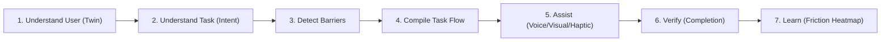

# Adapt-X — Hackathon Pitch Deck & Judge Presentation Structure

**Product**: Adapt-X (formerly Sahayak AI)  
**Tagline**: Intent-Aware Personal Accessibility Copilot  
**Theme**: Human-Centered AI & Assistive Technology

---

## Slide-by-Slide Presentation Structure (Judge Ready)

### Slide 1: Title & Vision
* **Title**: **Adapt-X** — The Intent-Aware Personal Accessibility Copilot
* **Subtitle**: Moving Beyond Isolated Tools: Dynamic, Intent-Aware Empowerment for 1.3 Billion People with Disabilities
* **Team**: Satvik Sharma & Team
* **Visual**: Clean mockups of Adapt-X on Android & Web with Accessibility Twin avatar.

---

### Slide 2: The Core Problem (The Fragmented Accessibility Crisis)
* **The Reality**: 1.3 Billion people globally live with significant functional disabilities (WHO).
* **The Failure of Existing Solutions**:
  1. **Isolated & Fragmented Tools**: Screen readers, OCR scanners, and voice assistants operate in silos with no shared context.
  2. **Zero Intent Awareness**: Current apps do not know *why* a user took a photo of a document or form.
  3. **Cognitive & Bureaucratic Overload**: Filling government scholarship or pension forms requires decoding complex jargon.
  4. **One-Size-Fits-All Fallacy**: Traditional accessibility features treat disability as static medical labels rather than dynamic interaction barriers.

---

### Slide 3: The Solution — Adapt-X
* **What is Adapt-X?** An end-to-end multimodal copilot that bridges the gap between physical intent and digital completion.
* **The 3 Pillars of Adapt-X**:
  1. **Accessibility Twin**: A dynamic, non-medical software profile of user interaction preferences (contrast, dwell time, input/output modalities, language).
  2. **Intent-Aware 7-Stage Pipeline**: Translates raw voice/camera inputs into actionable, barrier-free task steps.
  3. **Closed-Loop Verification & Telemetry**: Validates that tasks are completed safely and learns friction points with consented telemetry.

---

### Slide 4: Architectural Innovation — 7-Stage Intent Pipeline

* **Selective Model Activation**: Runs only required perception models (RapidOCR, MediaPipe ISL, YOLO/Spatial Vision) to conserve battery and latency on edge mobile hardware.
* **Object + OCR Fusion**: Contextual interpretation of physical environments (e.g. `door` + `EXIT` $\to$ `EMERGENCY EXIT DOOR at 10 o'clock`).

---

### Slide 5: Flagship Features & Live Demos
1. **Document Understanding & Action Extraction**:
   * Scans official notices, answers multi-turn questions in natural Hindi/English, and converts deadlines into structured actionable task flows.
2. **Accessible Form Completion**:
   * Real-time OCR bounding box detection flattens overwhelming bureaucratic forms into step-by-step voice dialogues.
3. **ISL (Indian Sign Language) Sign Talk**:
   * Real-time MediaPipe hand landmark tracking with custom gesture classification translating silent gestures into spoken and written language.
4. **Spatial Vision & 12-Hour Clock Direction**:
   * Qualitative spatial localization (e.g. *"Water bottle at 2 o'clock, waist level, within arm's reach"* + right haptic pulse).

---

### Slide 6: Technical Excellence & Production Readiness
* **Backend**: FastAPI with 30 modular, asynchronous REST endpoints.
* **AI Subsystem**: RapidOCR ONNX, MediaPipe Hand Tracking, OpenCV frame preprocessors, perceptual dHash duplicate suppression.
* **Mobile & Web**: Cross-platform Flutter client with haptic engine + Responsive web application.
* **Test Coverage**: **154 passing unit and integration tests** across the entire pipeline.
* **Privacy & Security**: Zero permanent disk storage of raw camera frames; ephemeral session sliding windows.

---

### Slide 7: Market Opportunity & Scalability
* **Target Audience**: Students with visual impairments, elderly citizens navigating public portals, hearing-impaired individuals using ISL.
* **B2B & Public Sector Integration**: SDK plug-in for government portals, banking apps, and university admission portals to achieve WCAG 2.2 AAA compliance automatically.
* **Future Roadmap**:
  * On-device Edge-AI quantization (TFLite / ONNX Runtime).
  * Direct Google Play Store deployment.
  * Wearable smart glasses integration (BLE frame streaming).

---

### Slide 8: The Judge Demo Journey
```text
Landing Page (sahayak_ai.html)
      ↓
Judge 1-Click Guest Login (Low Vision / Motor / Hearing Personas)
      ↓
Accessible Home (Real-time Twin Adaptation)
      ↓
Document Scanner & Q&A ("What is the last date to apply?")
      ↓
Voice-Driven Accessible Form Stepper
      ↓
ISL Sign Language Recognition
      ↓
Task Verification Certificate & Friction Heatmap
```
